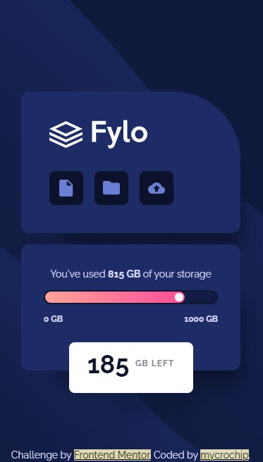
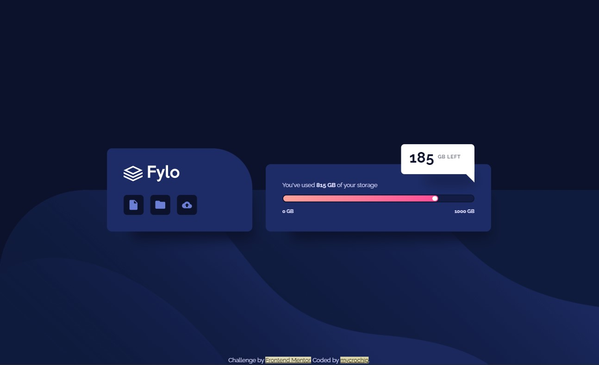

# Frontend Mentor - Fylo data storage component solution

This is a solution to the [Fylo data storage component challenge on Frontend Mentor](https://www.frontendmentor.io/challenges/fylo-data-storage-component-1dZPRbV5n). Frontend Mentor challenges help you improve your coding skills by building realistic projects. 

## Table of contents

- [Overview](#overview)
  - [The challenge](#the-challenge)
  - [Screenshot](#screenshot)
  - [Links](#links)
- [My process](#my-process)
  - [Built with](#built-with)
  - [What I learned](#what-i-learned)
  - [Continued development](#continued-development)
- [Author](#author)

## Overview

### The challenge

Users should be able to:

- View the optimal layout for the site depending on their device's screen size

### Screenshot

#### Moble View - 375px


#### Desktop View - 1440px



### Links

- Solution URL: [GitHub](https://github.com/mycrochip/fylo-data-storage-component.git)

- Live Site URL: [GitHub Pages](https://mycrochip.github.io/fylo-data-storage-component/)


## My process

### Built with

- Semantic HTML5 markup
- CSS custom properties
- Flexbox
- CSS Grid
- Mobile-first workflow


### What I learned

In this project, I used a screen-reader-only CSS, learned more about color gradients, understood positioning of child divs as a container inside parent divs which expand according to their parent (I used this in the progress bar).

One nice trick I also learned and implemented was the creation of a triangle by adjusting the thickness and color of borders as follows:

```css
.storage__remain::after {
    position: absolute;
    content: "";
    width: 0;
    height: 0;
  
    border-top: 25px solid transparent;
    border-bottom: 25px solid transparent;

    border-right: 25px solid var(--clr-neutral-1000);

    bottom: -1.25rem;
    right: 0;
}
```

### Continued development

More projects to be completed on [FrotendEnd Mentor](https://www.frontendmentor.io/)


## Author

- Frontend Mentor - [@mycrochip](https://www.frontendmentor.io/profile/mycrochip)
- Twitter - [@mycrochip_world](https://www.twitter.com/mycrochip_world)